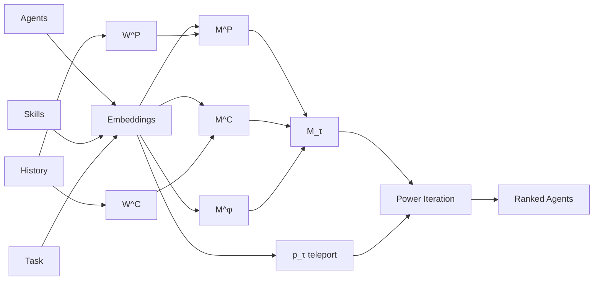
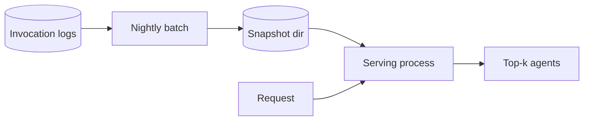

# Agent Ranking Algorithm

**HARP — Hybrid Agent Ranking via Personalized PageRank.**

A principled, production-ready engine for picking the right AI agent for any incoming task. Fuses three signals — historical performance, peer endorsement, and semantic similarity — into a single ranking score in single-digit milliseconds.

---

## Why

Given a fleet of heterogeneous agents (different model families, scaffolds, tool kits) and a fresh task description, *which agent should handle it?*

A naive router picks the highest semantic similarity. That gets fooled by agents who *advertise* themselves well. A historical router picks the highest past success rate. That breaks on tasks no one has tried. HARP combines both with a graph-structured fusion that is provably convergent and cold-start safe.

## How



Core update, iterated until the L1 residual drops below tolerance:

$$\mathbf{r}_{t+1} = \alpha \cdot \mathbf{M}_\tau \cdot \mathbf{r}_t + (1 - \alpha) \cdot \mathbf{p}_\tau$$

- `M_τ = β_P·M^P + β_C·M^C + β_φ·M^φ` — convex combination of three column-stochastic matrices.
- `p_τ` — softmax-weighted teleport vector built from the task embedding.
- `α = 0.85` — classical PageRank damping. Guarantees a Banach contraction → unique fixed point.

## Features

- **Three-signal fusion** with provable convergence (Banach rate `α`).
- **Cold-start safe** via Beta(1,1) prior on every agent–skill cell.
- **Disk snapshots** for warm restarts and atomic deploys.
- **Sub-10 ms p95 latency** on CPU; no GPU required.
- **Structured logging**, env-pinned config, reproducibility manifest.
- **Stateless serving** — scale horizontally behind any load balancer.

---


## Quick start

```bash
git clone <this-repo>
cd agent-ranking-algorithm
pip install -r agent_ranking_colab_codebases/requirements.txt

python agent_ranking_colab_codebases/harp.py                              # full demo
python agent_ranking_colab_codebases/harp.py --task "Summarize this PDF"  # rank one
```

Open `Agent ranking.ipynb` in Jupyter or Colab for the step-by-step build.

## Production deployment

Two processes — **batch builds state, serving answers requests.**



See [`agent_ranking_colab_codebases/README.md`](agent_ranking_colab_codebases/README.md) for snapshot, hot-reload, and SLO details.

## Documentation

- **Tutorial walkthrough**: [`documentation/harp-complete-tutorial.md`](documentation/harp-complete-tutorial.md)
- **Algorithm paper**: [`documentation/HARP alogrithm.pdf`](documentation/HARP%20alogrithm.pdf)
- **Research notes**: [`documentation/deep-research-report.md`](documentation/deep-research-report.md)
- **Enterprise report**: [`documentation/HARP_Enterprise_Project_Report.docx`](documentation/HARP_Enterprise_Project_Report.docx)

## License

Research prototype for the AgentHub project.
