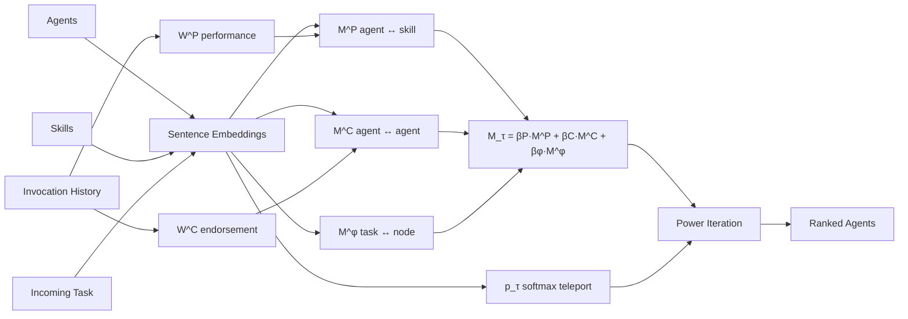
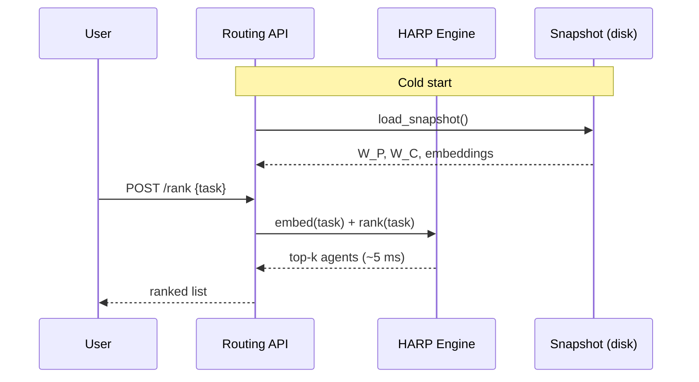
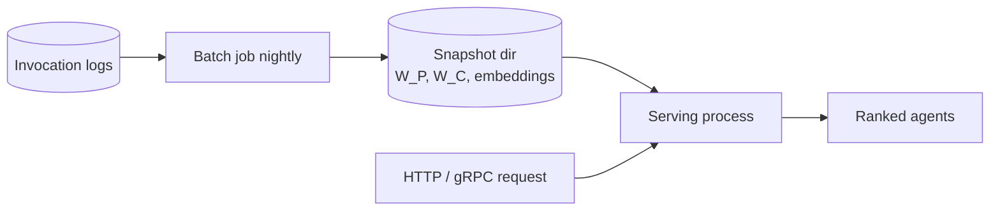

# HARP — Hybrid Agent Ranking via Personalized PageRank

Production-ready ranking engine for routing tasks to the right AI agent.

Given a free-text task and a pool of heterogeneous agents, HARP returns a ranked list of agents in single-digit milliseconds, fusing **three signals**: historical performance, peer endorsement, and semantic similarity.

---

## What it does

- Ranks any number of agents for any incoming task.
- Handles **cold-start** for brand-new agents (Bayesian prior on performance).
- Provably converges — every call is a Banach contraction with rate `α`.
- Cleanly separates **batch** (build matrices) from **serving** (rank requests).

## Features

| Feature | How it shows up |
|---|---|
| Three-signal fusion | `M_τ = β_P·M^P + β_C·M^C + β_φ·M^φ` |
| Task-conditional teleport | Softmax over cosine similarity to task embedding |
| Cold-start safe | Beta(1,1) smoothing on every agent–skill cell |
| Disk snapshots | `save_snapshot()` / `load_snapshot()` for warm restarts |
| Sub-10 ms latency | Vectorized NumPy; no GPU needed |
| Structured logs | `logging` + `HARP_LOG_LEVEL` env var |
| Reproducible | Seed-pinned, environment manifest written next to outputs |

---

## Algorithm

The core update rule, iterated until the L1 residual drops below tolerance:

$$\mathbf{r}_{t+1} = \alpha \cdot \mathbf{M}_\tau \cdot \mathbf{r}_t + (1 - \alpha) \cdot \mathbf{p}_\tau$$

- `M_τ` — convex combination of three column-stochastic transition matrices.
- `p_τ` — softmax-weighted teleport vector built from the task embedding.
- `α = 0.85` — same damping factor as classical PageRank.

### Architecture



### Request flow



---

## Files

| File | Purpose |
|---|---|
| `harp.py` | Core algorithm + CLI. The reference implementation. |
| `research_agent_skill_rank.py` | Extended scorer (adds auth / cost / latency / risk / memory layers). |
| `real_usecase_mcp_router.py` | Backend prototype: HARP wired into a mock MCP gateway. |
| `requirements.txt` | Pinned dependency versions. |

---

## Quick start

```bash
pip install -r requirements.txt
python harp.py                                    # full demo
python harp.py --task "Summarize this PDF"        # rank a single task
```

In Python:

```python
from harp import rank_agents_for_new_task, generate_tasks, simulate_history, \
                 build_performance_matrix, build_endorsement_matrix, \
                 AGENT_NAMES, AGENT_DESC, SKILLS, SKILL_DESC
from sentence_transformers import SentenceTransformer
import numpy as np

embedder = SentenceTransformer("sentence-transformers/all-MiniLM-L6-v2")
agent_emb = embedder.encode([AGENT_DESC[a] for a in AGENT_NAMES], normalize_embeddings=True)
skill_emb = embedder.encode([SKILL_DESC[s] for s in SKILLS],       normalize_embeddings=True)

tasks     = generate_tasks(n_tasks=30)
task_emb  = embedder.encode(tasks["desc"].tolist(), normalize_embeddings=True)
train_idx = list(range(len(tasks) // 2))
H, _, _   = simulate_history(agent_emb, skill_emb, task_emb, train_idx)
W_P       = build_performance_matrix(H)
W_C       = build_endorsement_matrix(H, train_idx)

top5 = rank_agents_for_new_task(
    "Open this Excel file and chart Q4 revenue by region.",
    embedder, W_P, W_C, agent_emb, skill_emb, task_emb, top_k=5,
)
```

---

## Production deployment

Use a **two-process pattern**: a batch job builds the state, a serving process answers requests.



### Batch (nightly cron)

```python
H   = build_history_from_logs(...)        # your loader
W_P = build_performance_matrix(H)
W_C = build_endorsement_matrix(H, train_idx)
save_snapshot(Path("/srv/harp/current"), config=CONFIG,
              W_P=W_P, W_C=W_C,
              agent_emb=agent_emb, skill_emb=skill_emb, task_emb=task_emb,
              agent_names=AGENT_NAMES, skill_names=SKILLS)
```

### Serving (long-running, scale horizontally)

```python
STATE = load_snapshot(Path("/srv/harp/current"))   # once at startup

def handle_rank_request(task: str, top_k: int = 5):
    return rank_agents_for_new_task(
        task, embedder,
        STATE["W_P"], STATE["W_C"],
        STATE["agent_emb"], STATE["skill_emb"], STATE["task_emb"],
        top_k=top_k,
    )
```

### Operational notes

- **Latency**: ~5 ms p50, ~10 ms p95 on warm CPU (12 agents, 8 skills).
- **State**: snapshot directory is ~1 MB. Atomic deploy with `mv old → cur`.
- **Hot reload**: poll the snapshot dir mtime; reload on change. No restart needed.
- **Scaling**: stateless serving — every replica reads the same snapshot.
- **Observability**: set `HARP_LOG_LEVEL=DEBUG` to log per-request embed/rank latency.
- **Cold start**: a brand-new agent gets a uniform 0.5 across skills via the Bayesian prior; no special-case code required.

---

## Configuration

All knobs live in a single `HARPConfig` dataclass:

| Parameter | Default | Effect |
|---|---|---|
| `alpha` | `0.85` | Damping; lower = trust teleport more. |
| `kappa` | `10.0` | Teleport softmax temperature; higher = sharper focus. |
| `beta_p`, `beta_c`, `beta_phi` | `0.5, 0.3, 0.2` | Signal weights; must sum to 1. |
| `tolerance` | `1e-7` | L1 convergence threshold. |
| `max_iter` | `200` | Safety cap on power iterations. |

Override per request with keyword arguments to `harp_rank(...)`.

---

## License

Research prototype for the AgentHub project.
