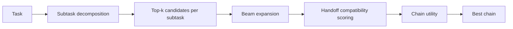

# AgentRank and SkillRank for a Universal MCP Gateway

## Executive summary

The strongest design for AgentHub is **not** a single monolithic ranking score. It is a **two-stage probabilistic router**: a **global prior** over agents derived from network structure and historical usage, and a **task-conditional posterior** that adds semantic relevance, capability coverage, memory compatibility, live auth state, trust/safety, and operational cost. This follows the same conceptual split that made PageRank valuable in Web search: a query-independent notion of authority is useful, but by itself it is not enough; later work such as topic-sensitive PageRank showed that authority must be conditioned on context, while recommender-system research showed that effective ranking usually mixes content, collaborative history, and hybrid signals rather than relying on a single signal family. citeturn10view0turn7view2turn8view1turn7view3turn7view4turn8view3

For a Universal MCP Gateway, that implies a clean separation of concerns. **AgentRank** should answer, “Which agents, tools, publishers, and workflows are globally authoritative and reliable in this ecosystem?” **SkillRank** should answer, “Given this task, this workspace, this memory scope, these auth constraints, and this budget, which feasible agent is most likely to succeed?” This is especially important because MCP standardizes tool, prompt, and resource exposure through JSON-RPC and HTTP transports, while A2A addresses agent-to-agent collaboration as a complementary layer; AgentHub therefore sits at the boundary where both global ecosystem structure and task-local routing matter. citeturn14search0turn14search1turn14search2turn14search5turn15search0turn15search6

My recommended formulation is a **heterogeneous random-walk authority model** for AgentRank, combined with a **log-linear posterior router** for SkillRank and a **beam-search chain utility** for multi-agent workflows. The resulting system is easy to explain, supports online updates, and can later be learned from real logs using pairwise personalized ranking objectives such as BPR rather than staying permanently hand-tuned. citeturn10view0turn12view0turn7view4turn8view3

I also prepared a Colab-ready notebook file that implements this design on synthetic data with **100 agents, 500 tools, and 5,000 interactions**, including graph generation, AgentRank power iteration, SkillRank computation, beam-search chain routing, parameter sweeps, evaluation metrics, and charts. [Download the Colab notebook](sandbox:/mnt/data/agentrank_skillrank_universal_mcp_gateway.ipynb)

## Research foundations

PageRank’s essential contribution was to model ranking as the stationary distribution of a random surfer over a graph, with rank propagated through links and controlled by a damping factor plus a teleport distribution. In the original formulation, a page’s value rises when it is pointed to by other high-value pages; the score is computed iteratively and corresponds to the dominant eigenvector of a normalized link matrix. That makes PageRank a strong model for **global authority** but a weak model for **task-specific fit**, because the score is intentionally query-agnostic. citeturn10view0turn9view0

HITS solved a different problem. Kleinberg’s hubs-and-authorities model is **query-dependent** and uses a mutually reinforcing relationship: a good hub points to many good authorities, and a good authority is pointed to by many good hubs. That is useful for AgentHub because it suggests that delegation graphs contain more information than simple popularity. In agent ecosystems, some agents are “authorities” for a skill, while others act as “hubs” by reliably orchestrating or delegating to those authorities. But HITS is less attractive as the sole global score because it is more local/query-dependent and more sensitive to subgraph construction. citeturn12view0turn12view2

Recommender systems contributed a different insight: useful ranking is usually built from **multiple evidence sources**. A canonical survey separates recommenders into content-based, collaborative, and hybrid families, and hybrid approaches are attractive precisely because each single method has failure modes such as sparsity, cold start, or over-reliance on past behavior. GroupLens and later recommender work also made explicit that the real target is not just prediction, but **personalized ranking under implicit feedback**, which is exactly the routing problem AgentHub faces. citeturn8view1turn9view3turn4search5turn4search0turn8view3

Graph-based recommender methods sit between PageRank and collaborative filtering. ItemRank, for example, adapted random walks to recommendation, showing that graph propagation can be used not only for authority but also for expected user preference. Topic-sensitive PageRank similarly showed that a global graph prior becomes more useful when it is modulated by context at query time. The design implication for AgentHub is straightforward: use a PageRank-like global prior, but do **not** let it dominate the final choice; it should act as a prior that is adjusted by task-conditioned evidence. citeturn7view4turn9view4turn7view2turn9view2

The final piece comes from personalized ranking objectives. Rendle’s BPR paper showed that many recommender methods were not optimized for ranking directly, and that pairwise ranking objectives over implicit feedback can outperform point-prediction objectives for personalized ranking. That matters here because routing logs will mostly look like implicit feedback: chosen vs not chosen, success vs failure, approved vs rejected, on-budget vs over-budget. So the right long-term path is to start with interpretable priors and then learn their relative strength from pairwise routing outcomes. citeturn8view3turn13view4

The comparison below captures the design tradeoff.

| Family | What it ranks well | Where it fails for AgentHub | What to reuse |
|---|---|---|---|
| PageRank | Stable global authority from graph structure | Query/task agnostic; can over-reward incumbents | Use as a prior over globally authoritative agents |
| HITS | Query-local hubs and authorities | Sensitive to subgraph choice; weaker as a single global score | Use delegation structure and mutual reinforcement as features |
| Content-based recommendation | Semantic task-agent matching | Cold start on usage history; ignores ecosystem trust/popularity | Use embeddings for task relevance |
| Collaborative / implicit-feedback ranking | Learns from what users and systems actually select | Sparsity and popularity bias; weak on unseen tasks without content features | Learn weights from routing logs |
| Random-walk recommender methods | Blend graph propagation with recommendation | Still needs context, safety, auth, and cost signals | Use graph propagation on heterogeneous agent-tool ecosystems |
| Hybrid recommenders | Combines complementary signals | More design complexity | Best fit for AgentHub |

This synthesis is directly supported by the primary literature above. citeturn10view0turn12view0turn8view1turn7view3turn7view4turn8view3

## Formal hybrid algorithm

### AgentRank as a heterogeneous authority prior

Let the AgentHub ecosystem be a directed heterogeneous graph \(G=(V,E)\) with node types such as agents \(A\), tools \(T\), skill categories \(S\), publishers \(P\), and optionally workflows \(W\). PageRank’s random-surfer view extends naturally to such a graph, and heterogeneous random-walk recommendation work supports exactly this kind of construction. citeturn10view0turn7view4

For each edge type \(\ell\), define a recency-weighted edge intensity:

\[
\tilde{w}^{(\ell)}_{ij}
=
\log\!\bigl(1+c^{(\ell)}_{ij}\bigr)\;
\exp\!\left(-\frac{\Delta t_{ij}}{\tau_\ell}\right)\;
q^{(\ell)}_{ij}.
\]

Here \(c^{(\ell)}_{ij}\) is a count-like signal such as successful tool uses, successful delegations, installs, or workflow co-occurrence; \(\Delta t_{ij}\) is the age of the interaction; \(\tau_\ell\) is the decay horizon for that edge type; and \(q^{(\ell)}_{ij}\) is an optional quality multiplier such as success rate, user rating, or verified-publisher weight. The \(\log(1+c)\) transform keeps high-volume agents from dominating purely through scale, which is important in heavy-tailed ecosystems. This exact transform is my recommendation, but it inherits the same core motivation as PageRank and graph-based recommendation: structure matters, but raw degree alone is too crude. citeturn10view0turn12view0turn7view4

Combine edge types through nonnegative coefficients \(\beta_\ell\):

\[
W_{ij} = \sum_{\ell} \beta_\ell \tilde{w}^{(\ell)}_{ij}.
\]

Row-normalize \(W\) into a transition matrix \(P\), and define a teleport prior \(\pi\) over all nodes. Following PageRank and topic-sensitive PageRank, the stationary distribution is:

\[
r = (1-d)\pi + d P^\top r.
\]

The default damping factor should be \(d=0.85\), because that remains the canonical working point in PageRank-style systems: high enough to preserve graph signal, but low enough to prevent sinks and make teleportation meaningful. If the graph becomes much noisier or more nonstationary, a lower \(d\) in the \(0.70\)–\(0.80\) range is often easier to update and less likely to over-trust stale structure; if the graph is stable and high quality, \(0.90\)–\(0.95\) can strengthen ecosystem authority effects. This recommendation is a design inference from the original PageRank use of decay/teleportation and later context-sensitive extensions. citeturn10view0turn7view2

The teleport vector should be **trust-aware**, not uniform:

\[
\pi_i \propto \exp\!\bigl(
\nu_1 \,\mathrm{verified}_i
+
\nu_2 \,\mathrm{trust}_i
+
\nu_3 \,\mathrm{publisherQuality}_i
-
\nu_4 \,\mathrm{incidentRate}_i
\bigr).
\]

This is not part of the classical PageRank paper; it is my recommended adaptation for agent ecosystems, motivated by the fact that OWASP now explicitly identifies excessive functionality, permissions, and autonomy as agentic risk factors. A routing system that treats historical centrality as more important than safety is architecturally wrong. citeturn9view8turn7view12

Finally, extract only the agent slice:

\[
\mathrm{AgentRank}(a)
=
\frac{r_a}{\sum_{a' \in A} r_{a'}}.
\]

This gives a stable global prior over agents without forcing tools, skills, or publishers to be routed directly.

### SkillRank as a task-conditional posterior

PageRank-like authority is useful, but personalized ranking literature is clear that final ranking quality depends on optimizing for the actual ranking task, not just on imposing a global prestige order. The clean way to do that is to treat AgentRank as a **prior** and the task-time feature set as a **likelihood-like** term. citeturn8view3turn13view4

Let \(q\) be a task and \(x\) the runtime context, including workspace state, active connections, memory scope, budget, device/client, and upstream chain state. For candidate agent \(a\), define a hard gate:

\[
g(a,q,x)=
\mathbb{1}[\text{permissions satisfied}]
\cdot
\mathbb{1}[\text{required auth present}]
\cdot
\mathbb{1}[\text{policy allows access}].
\]

This is essential. Missing auth, blocked permissions, or policy violations should **remove** an agent from the candidate set rather than merely penalize it softly. MCP’s auth model is transport-level and OAuth-based for HTTP transports, while agent security guidance now treats over-privileged action surfaces as a major risk category. citeturn14search2turn7view9turn7view13turn9view8

Define positive features \(f_j(a,q,x)\in[0,1]\):

\[
f(a,q,x)=
\bigl[
f_{\text{sem}},
f_{\text{cap}},
f_{\text{mem}},
f_{\text{auth}},
f_{\text{userHist}},
f_{\text{wsHist}},
f_{\text{trust}},
f_{\text{costEff}},
f_{\text{latEff}},
f_{\text{handoff}}
\bigr].
\]

I recommend:

\[
f_{\text{sem}}
=
\max\!\left(0,\frac{1+\cos(e_q,e_a)}{2}\right),
\]

using sentence embeddings for the task text and agent description. Sentence-BERT is an appropriate optional choice because it was designed specifically to make semantic similarity search efficient through cosine-comparable embeddings. citeturn13view5

\[
f_{\text{cap}}
=
\frac{|\mathrm{ReqCaps}(q)\cap \mathrm{Caps}(a)|}{|\mathrm{ReqCaps}(q)|},
\qquad
f_{\text{auth}}
=
\frac{\#\{\text{required providers connected and supported}\}}{\#\{\text{required providers}\}},
\]

\[
f_{\text{mem}}
=
\frac{|\mathrm{ReqScopes}(q)\cap \mathrm{MemScopes}(a)|}{|\mathrm{ReqScopes}(q)\cup \mathrm{MemScopes}(a)|},
\]

\[
f_{\text{costEff}}
=
1-\min\!\left(\frac{\hat C(a,q)}{B_q},\,1.5\right)/1.5,
\qquad
f_{\text{latEff}}
=
1-\min\!\left(\frac{\hat L(a,q)}{\Lambda_q},\,1.5\right)/1.5.
\]

For the global prior, use log authority rather than raw authority to avoid letting a highly skewed PageRank distribution swamp task-specific evidence:

\[
f_{\text{authority}}
=
\log(\mathrm{AgentRank}(a)+\epsilon).
\]

Then define penalties \(p_k(a,q,x)\in[0,1]\), for example:

\[
p_{\text{risk}}
=
\mathrm{taskRisk}(q)\cdot \max(0,\mathrm{agentRisk}(a)-\mathrm{trust}(a)),
\]

\[
p_{\text{missingScope}} = 1-f_{\text{mem}},
\qquad
p_{\text{privilegeExcess}}
=
\frac{\max(0, |\mathrm{Caps}(a)|-|\mathrm{ReqCaps}(q)|)}{|\mathrm{Caps}(a)|}.
\]

The resulting **SkillRank log-score** is:

\[
S(a\mid q,x)
=
\eta \log(\mathrm{AgentRank}(a)+\epsilon)
+
\sum_j w_j f_j(a,q,x)
-
\sum_k \lambda_k p_k(a,q,x).
\]

And the routing posterior is:

\[
P(a\mid q,x)
=
\frac{
g(a,q,x)\exp(S(a\mid q,x))
}{
\sum_{b\in A}
g(b,q,x)\exp(S(b\mid q,x))
}.
\]

This is the central recommendation of the report: AgentRank is a prior, SkillRank is a posterior.

### Handoff compatibility and ChainRank

Because A2A and MCP are complementary rather than competing, a Universal MCP Gateway should rank not only individual agents but also **agent chains**. MCP governs tool/resource interaction, while A2A governs actual agent-to-agent coordination. That makes handoff quality a first-class ranking signal. citeturn15search0turn15search6

For consecutive agents \(a\) and \(b\), define a geometric-mean compatibility score:

\[
H(a,b\mid q)
=
\left(
\prod_{r=1}^{R}
h_r(a,b\mid q)^{\gamma_r}
\right)^{1/\sum_r \gamma_r}.
\]

A good default decomposition is:

\[
h_r \in
\{
\text{historical handoff success},
\text{skill/schema compatibility},
\text{memory overlap},
\text{auth continuity}
\}.
\]

The geometric mean is deliberate: it prevents one strong factor from fully masking one catastrophic factor. In routing terms, a chain should not look “good” if it historically hands off well but cannot share required memory scope or lacks downstream auth continuity.

For a task decomposed into subtasks \(q_1,\dots,q_m\) and a chain \(c=(a_1,\dots,a_m)\), define:

\[
U(c\mid q,x)
=
\sum_{t=1}^{m} S(a_t\mid q_t,x_t)
+
\kappa\sum_{t=1}^{m-1}\log\!\bigl(H(a_t,a_{t+1}\mid q)+\epsilon\bigr)
-
\lambda_C \tilde C(c)
-
\lambda_L \tilde L(c)
-
\lambda_R \tilde R(c)
-
\mu(m-1).
\]

The last term is a chain-length penalty: multi-agent decomposition is valuable, but unnecessary decomposition should be discouraged because it increases latency, token overhead, and failure surface. The optimal chain is approximated by beam search over top candidates per subtask.

## Parameterization and learning

### Default weights and why they look this way

The most important design rule is that **task fulfillment should dominate authority**. PageRank and HITS are valuable precisely because they encode global structure, but the literature also makes clear that they are not the same thing as personalized relevance. Hybrid recommenders outperform single-signal systems because they give content/context and historical/graph evidence different roles. citeturn10view0turn12view0turn8view1turn7view3turn7view4turn8view3

I recommend the following **initial priors** for SkillRank, before any supervised learning from production logs:

| Term | Default weight |
|---|---:|
| semantic similarity | 0.24 |
| capability coverage | 0.18 |
| memory fit | 0.10 |
| auth readiness | 0.10 |
| AgentRank authority | 0.09 |
| user history success | 0.08 |
| trust score | 0.07 |
| workspace history success | 0.05 |
| cost efficiency | 0.04 |
| latency efficiency | 0.03 |
| handoff compatibility | 0.02 |
| risk penalty | 0.12 |
| missing memory-scope penalty | 0.08 |
| privilege-excess penalty | 0.05 |

These are not claimed as universal truths; they are a principled **bootstrapping prior**. The logic is that semantic relevance and capability coverage should together dominate, because they are the nearest proxy for actual task completion. Memory fit and auth readiness are next because the right agent still fails if it cannot access the right scoped memory or the necessary provider. AgentRank gets a moderate weight because routing should respect accumulated ecosystem knowledge without allowing incumbents to crowd out better task fits. Cost and latency are intentionally weaker by default, because most users prefer the best correct route among feasible candidates unless they are on tight budgets or latency SLOs. Safety penalties are larger than cost penalties because unsafe autonomy is a product risk, not merely an efficiency issue. citeturn7view2turn8view3turn9view8

### Normalization

Normalization matters more than most teams expect. AgentRank is usually heavy-tailed, cost and latency are often long-tailed, and trust metrics are sparse in early systems. My recommendation is:

\[
\bar r_a = \mathrm{minmax}_{p5,p95}\bigl(\log(\mathrm{AgentRank}(a)+\epsilon)\bigr),
\]

so authority is log-scaled and percentile-clipped before entering SkillRank; otherwise a few dominant agents can numerically swamp all other features. For cost and latency, use clipped budget-relative transforms like the \(f_{\text{costEff}}\) and \(f_{\text{latEff}}\) terms above. For success-history features, use Bayesian smoothing such as Beta posteriors to avoid unstable estimates in the cold-start regime.

### Update cadence

The global graph should not be recomputed at the same cadence as live runtime state. PageRank-style structure changes more slowly than auth validity, latency, or pricing, and incremental PageRank work shows that random-walk scores can be maintained efficiently on evolving graphs rather than recomputed from scratch every time. citeturn7view11turn9view7

A good production rhythm is:

| Signal family | Suggested cadence |
|---|---|
| auth readiness, token validity, provider outages | real time |
| rolling latency, cost, token use, incidents | real time or near real time |
| workspace/user success tables, handoff tables | every few minutes |
| incremental AgentRank on affected subgraph | hourly |
| full AgentRank recompute and calibration | nightly |

### Learning the weights

Once routing logs exist, the default weights should become priors rather than permanent constants. The best direct learning objective is pairwise personalized ranking:

\[
\max_{\theta}
\sum_{(q,a^+,a^-)}
\log \sigma\!\bigl(S_\theta(q,a^+) - S_\theta(q,a^-)\bigr)
-
\lambda\lVert \theta-\theta_0\rVert_2^2,
\]

where \(a^+\) is a successful or preferred route, \(a^-\) is a failed or rejected route, and \(\theta_0\) is the initial prior vector above. This is a direct adaptation of BPR to routing and is well aligned with the kind of implicit feedback AgentHub will actually produce. citeturn8view3turn13view4

## Evaluation strategy

The evaluation story should follow recommender-system best practice: use **offline experiments** to eliminate weak routing policies, then move the best candidates into controlled online tests. Shani and Gunawardana explicitly describe offline experiments as a low-cost filtering step for candidate recommenders, while Herlocker and colleagues emphasize that evaluation depends on the actual user task and cannot be reduced to a single generic metric. citeturn13view2turn9view5turn13view3

### Ranking metrics

For offline ranking quality, the essential metrics are:

\[
\mathrm{Precision@}k
=
\frac{1}{k}
\sum_{i=1}^{k}
\mathbb{1}[\mathrm{rel}_i > 0],
\]

and

\[
\mathrm{DCG@}k
=
\sum_{i=1}^{k}
\frac{2^{\mathrm{rel}_i}-1}{\log_2(i+1)},
\qquad
\mathrm{nDCG@}k
=
\frac{\mathrm{DCG@}k}{\mathrm{IDCG@}k}.
\]

nDCG is especially appropriate here because it handles **graded relevance**, not just binary relevance, and directly rewards putting the most valuable candidates earlier in the ranking. That is exactly the right lens for routing, where “partially good but expensive” and “safe but incomplete” should not be scored the same as “fully correct, safe, on-budget.” citeturn7view6turn9view6turn13view0

### Operational and business metrics

For AgentHub, ranking metrics alone are not enough. I recommend reporting the following side by side:

| Metric | Why it matters |
|---|---|
| success@1 and success@k | Did the selected route actually complete the task? |
| chain success rate | Did all steps complete in a multi-agent workflow? |
| cost-efficiency | Successes per dollar of estimated cost |
| token-efficiency | Successes per 1,000 tokens or per token-dollar |
| latency-constrained success | Success under P95 latency SLO |
| oracle regret | Gap vs the best feasible agent/chain in hindsight |
| safety violation rate | Missing approval, prohibited tool, over-privileged route |
| auth failure rate | Candidate selected but not actually authorized |

These are proposed metrics for agent routing rather than literature-standard names, but they fit squarely into the evaluation dimensions recommended by recommender-system evaluation work: not only accuracy, but also downstream utility and other application-specific properties. citeturn9view5turn13view2

### Experimental design

A robust offline design for AgentHub should be **temporal**, not randomized. Logs from a routing system are not IID; new agents arrive, auth changes, memory grows, and rankings shift. Use a time split such as 70% train, 15% validation, and 15% test. On each task, compute a graded relevance set from hidden or empirical outcome quality, then compare:

- popularity / historical success baseline,
- semantic-only ranking,
- AgentRank-only ranking,
- no-graph hybrid ranking,
- full AgentRank + SkillRank,
- full chain ranking with beam search.

The key ablations are obvious: remove authority, remove memory-fit, remove auth-readiness, remove trust penalty, remove handoff compatibility, and vary the damping factor \(d\), authority exponent \(\eta\), beam width, and cost/risk penalties. This is also where the notebook’s parameter sweeps are most useful. citeturn7view4turn8view3turn13view2

## Colab prototype and API

I prepared a downloadable notebook here: [Download the Colab notebook](sandbox:/mnt/data/agentrank_skillrank_universal_mcp_gateway.ipynb)

The notebook includes the full requested prototype:

- synthetic generation of **100 agents, 500 tools, and 5,000 interactions**,  
- optional text embeddings using **Sentence-Transformers** or deterministic mock embeddings,  
- heterogeneous graph construction over agents, tools, skills, and publishers,  
- iterative AgentRank computation,  
- SkillRank features and task-time scoring,  
- beam-search ChainRank for multi-agent flows,  
- simulated routing for **travel booking**, **email triage**, and **code triage**,  
- offline evaluation with **precision@k**, **nDCG@k**, **success rate**, **cost-efficiency**, and **regret**,  
- parameter sweeps over damping and authority exponent,  
- matplotlib-based ranking and tradeoff charts.

### Input and output API

The prototype’s core API is intentionally simple:

| Function | Inputs | Outputs |
|---|---|---|
| `compute_agentrank` | historical steps, tool logs, damping | agent-rank dataframe, full node ranks, graph tables, convergence history |
| `rank_agents_for_task` | task row, optional previous agent, weights | top-k ranked agents and full candidate ranking |
| `beam_search_chain` | task row, beam width, top candidates per step | ranked candidate chains |
| `route_task` | task row, mode, weights, beam width | selected single agent or multi-agent chain |
| `evaluate_models` | test task IDs, ranking params | per-task metrics and summary metrics |

### Sample synthetic workloads

The notebook uses three concrete workload families because they expose different routing tradeoffs:

| Use case | Why it matters |
|---|---|
| travel booking | high-risk, auth-heavy, multi-agent, calendar/payment coupling |
| email triage | moderate-risk, memory-heavy, fast-turnaround |
| code triage | capability-heavy, GitHub-auth-bound, lower safety risk but strong semantic variation |

Those are intentionally complementary. Travel stresses auth and approvals, email stresses personalization and memory, and code triage stresses skill matching.

## Production considerations and limitations

### Why MCP and A2A change the ranking problem

MCP now defines a stateful client-host-server architecture with JSON-RPC, capability negotiation, tools/resources/prompts, Streamable HTTP transport, and transport-level authorization for HTTP-based servers. A2A is positioned as complementary, not competitive: MCP is for agent-to-tool interaction, while A2A is for agent-to-agent interoperability. In practical terms, AgentHub’s ranking layer must handle both **tool selection under MCP** and **workflow composition under A2A**, which is exactly why single-score routing is insufficient. citeturn14search0turn14search1turn14search2turn14search3turn14search4turn15search0turn15search6

### Security and safety

This system must never let ranking override security. OWASP’s current agent-risk guidance is explicit that excessive functionality, excessive permissions, and excessive autonomy are core causes of agentic failures. In production, that means prohibited scopes, missing approvals, and missing auth should remain **hard filters**, not soft penalties; SkillRank should only operate over the feasible set. On the identity side, MCP’s auth model for HTTP transports is OAuth-based, and OAuth security best current practice now explicitly deprecates weaker or insecure modes of operation. citeturn9view8turn7view12turn14search2turn7view13turn9view9

### Real-time updates and compute cost

Full graph recomputation is easy at notebook scale and costly at large scale. Incremental PageRank methods exist specifically for dynamically evolving graphs, which makes them a plausible foundation for hourly or sub-hourly authority refresh on real AgentHub traffic. The right production split is: incremental authority maintenance over the affected subgraph, streaming feature refresh for auth/latency/cost, and daily or nightly global recalibration. citeturn7view11turn9view7

### Storage and systems design

For a first production implementation, store interaction logs, feature tables, auth state, and ranking outputs in a relational store; keep graph edges materialized or incrementally aggregated; and compute AgentRank in batch or micro-batch. Embeddings can live in a vector store or in-column vector type if your database supports it. The important systems principle is not the storage engine; it is keeping **global graph state**, **workspace/user statistics**, and **live runtime state** separate, because they change on different clocks.

### Limitations and open questions

This framework is strong, but it has real limitations. PageRank-like authority can still over-reward incumbents and slow down discovery of excellent new agents. Historical logs can encode survivorship bias and approval-policy artifacts. Synthetic experiments are useful for prototyping but do not capture prompt injection, provider outages, UI friction, or hidden human preferences. Finally, learned routing policies can drift as the ecosystem changes, so regular recalibration and post-deployment audits are necessary. Those are not reasons to avoid AgentRank + SkillRank; they are reasons to keep it interpretable, evaluable, and safety-gated.